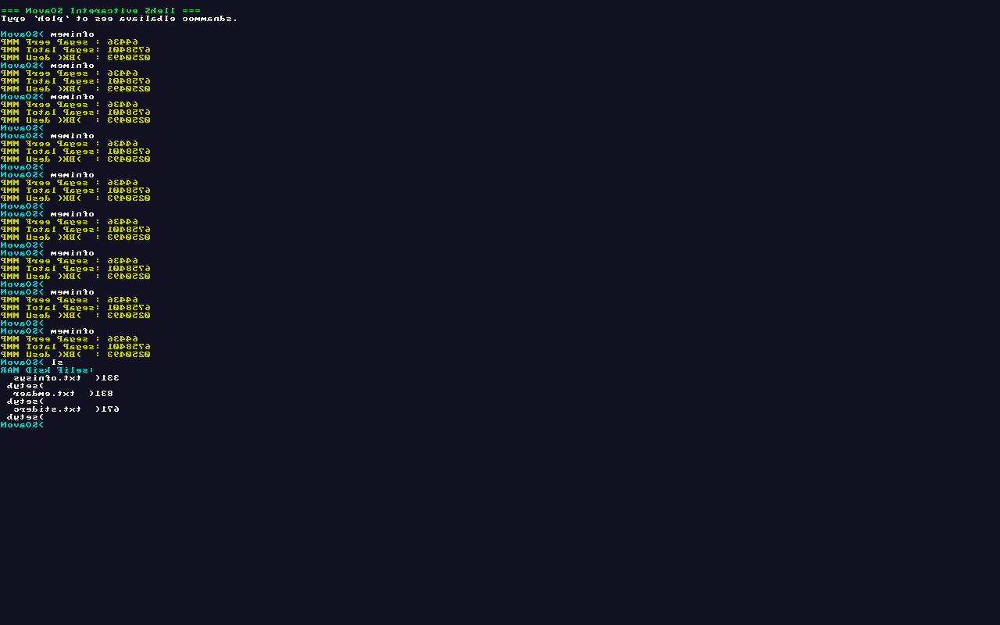
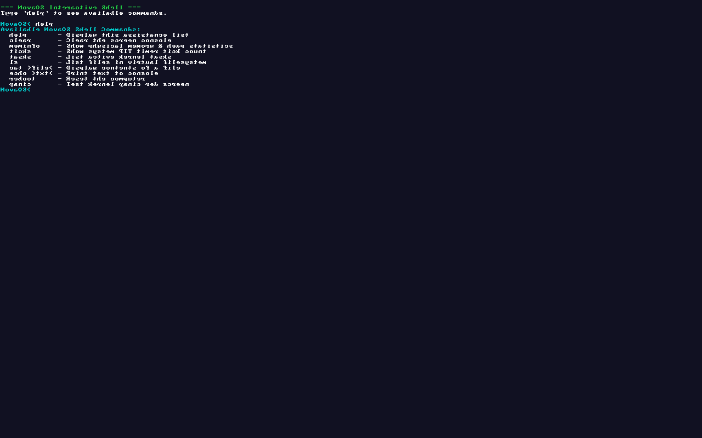

# NovaOS 🌌
### A Modular, Freestanding 64-Bit UEFI Operating System Written in C++20 and NASM Assembly

NovaOS is a modern, modular, from-scratch 64-bit operating system designed to explore low-level system software development, UEFI firmware boot paths, higher-half kernel architecture, hardware interrupt handling, physical memory allocation, and preemptive multitasking.

Targeted for bare-metal `x86_64-elf`, NovaOS boots natively via the **Limine 8.x protocol** on modern UEFI firmware (QEMU OVMF) without legacy BIOS dependencies.

---

# 📸 NovaOS Screenshots

## 🚀 Boot Screen

<p align="center">
  
</p>

---

## 💻 Interactive Shell

<p align="center">
  
</p>

---

## 🧠 Memory Information

<p align="center">
  
</p>

---

## 🚨 Kernel Panic (Red Screen of Death)

<p align="center">
  
</p>

---
## 🌟 Key Features & Architecture

- 🚀 **UEFI Boot & Higher-Half Kernel**: Boots directly into Long Mode (64-bit) at virtual base `0xFFFFFFFF80000000`.
- 🛡️ **GDT & IDT**: Owns CPU descriptor tables, 64-bit Task State Segment (TSS), 256-entry IDT, and 32 NASM exception trampolines.
- 🎨 **Kernel Panic System**: Formatted register dump on serial COM1 UART + bright red screen of death on GOP framebuffer.
- 🧠 **Physical Memory Manager (PMM)**: 128 KB bitmap allocator managing 4 GB of RAM using Limine Higher-Half Direct Map (HHDM).
- 📦 **Kernel Heap**: First-fit linked-list allocator providing freestanding `kmalloc()`, `kfree()`, and `kzalloc()`.
- ⚡ **Hardware Interrupts**: 8259A PIC remapping (IRQ0–15), PIT timer (100 Hz), and PS/2 Keyboard driver with Shift & CapsLock handling.
- 🖥️ **Console Driver**: GOP Framebuffer text rendering with an embedded 8×8 VGA font, color styling, backspace, and line scrolling.
- 🔄 **Preemptive Multitasking**: Task Control Blocks (TCB), cooperative/preemptive NASM `context_switch()`, and Round-Robin scheduling.
- 📁 **Virtual File System (VFS)**: In-memory RAM disk supporting file listing (`ls`) and reading (`cat`).
- 💻 **Interactive Shell**: Built-in kernel shell with commands (`help`, `clear`, `meminfo`, `ticks`, `tasks`, `ls`, `cat`, `echo`, `reboot`, `panic`).

---

## 🛠️ Build & Setup Guide (Windows 11 / Native)

### Prerequisites

NovaOS uses a clean, portable Windows build pipeline without needing WSL2 or admin privileges.
Install the following via Windows Package Manager (`winget`) or ensure they are in your PATH:

```powershell
winget install MartinStorsjo.LLVM-MinGW.UCRT
winget install Ninja-build.Ninja
```

*(Note: CMake, NASM, QEMU, and OVMF firmware are automatically configured/downloaded locally by the build script if not present).*

---

## 🏃 Running NovaOS

### 1. Clone the Repository

```powershell
git clone https://github.com/ParthChittalwar/NovaOS-Operating-System
cd NovaOS
```

### 2. Build the Kernel

Run the PowerShell build script to compile C++/NASM sources using direct `ld.lld` ELF linking:

```powershell
.\scripts\build.ps1
```

### 3. Launch in QEMU

Run the boot script to launch QEMU with UEFI firmware and serial console output:

```powershell
.\scripts\run-qemu.ps1
```

---

## 📸 Boot Log Output

```text
=== NovaOS Kernel Booting ===
[M2] GDT loaded (Null, KCode, KData, UCode, UData, TSS).
[M1] GOP Framebuffer initialized.
[M3] PMM initialized (Bitmap physical allocator).
[M3] Kernel Heap initialized (kmalloc/kfree ready).
[M4] PIC remapped (Master: 32, Slave: 40).
[M4] PIT timer configured at 100 Hz.
[M4] PS/2 Keyboard driver active.
[M2/M4] IDT installed (32 Exceptions + IRQ0 + IRQ1).
[M6] Virtual File System mounted (RAM Disk).
[M5] Round-robin scheduler active.

=== NovaOS Interactive Shell ===
Type 'help' to see available commands.

[M7] Interactive Kernel Shell ready.
[boot] Interrupts enabled (STI). Boot sequence finished!

NovaOS> help
Available NovaOS Shell Commands:
  help       - Display this assistance list
  clear      - Clear the screen console
  meminfo    - Show physical memory & heap statistics
  ticks      - Show system PIT timer tick count
  tasks      - List active kernel tasks
  ls         - List files in virtual filesystem
  cat <file> - Display contents of a file
  echo <txt> - Print text to console
  reboot     - Reset the computer
  panic      - Test kernel panic red screen
```

---

## 📂 Repository Structure

```
NovaOS/
├── boot/
│   └── limine.conf                 # Limine bootloader configuration
├── docs/
│   ├── PRD.md                      # Product Requirements Document
│   ├── architecture.md             # Subsystem architecture details
│   ├── build-guide.md              # Build & toolchain documentation
│   └── milestones.md               # Milestone history
├── kernel/
│   ├── arch/x86_64/
│   │   ├── gdt.hpp / gdt.cpp       # Global Descriptor Table & TSS
│   │   ├── idt.hpp / idt.cpp       # Interrupt Descriptor Table & Dispatcher
│   │   └── isr_stubs.asm           # NASM Exception & IRQ trampolines
│   ├── drivers/
│   │   ├── pic.hpp / pic.cpp       # 8259A PIC Driver
│   │   ├── pit.hpp / pit.cpp       # PIT Timer Driver
│   │   ├── keyboard.hpp / cpp      # PS/2 Keyboard Driver
│   │   └── framebuffer.hpp / cpp   # GOP Framebuffer Console Driver
│   ├── mm/
│   │   ├── pmm.hpp / pmm.cpp       # Physical Memory Manager (Bitmap)
│   │   └── heap.hpp / heap.cpp     # Kernel Heap (kmalloc/kfree)
│   ├── sched/
│   │   ├── task.hpp                # Task Control Block
│   │   ├── scheduler.hpp / cpp     # Preemptive Round-Robin Scheduler
│   │   └── context_switch.asm      # NASM Context Switch Routine
│   ├── fs/
│   │   └── vfs.hpp / vfs.cpp       # Virtual File System & RAM Disk
│   ├── shell/
│   │   └── shell.hpp / shell.cpp   # Interactive Kernel Shell
│   ├── lib/
│   │   └── panic.hpp / panic.cpp   # Kernel Panic System
│   ├── kernel_main.cpp             # Kernel entry point (_start)
│   ├── limine.h                    # Limine protocol header
│   └── linker.ld                   # Higher-half ELF64 Linker Script
├── scripts/
│   ├── build.ps1                   # Automated build script
│   └── run-qemu.ps1                # QEMU boot launcher script
├── CMakeLists.txt                  # Top-level CMake configuration
├── LICENSE                         # MIT License
└── README.md                       # Project overview & guide
```

---

## 📜 License

NovaOS is open-source software licensed under the [MIT License](LICENSE).
